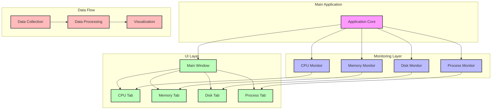

# System Monitor

A Python-based system monitoring tool that provides real-time information about CPU, memory, disk, and process usage.

## System Architecture



## Features

- CPU Monitoring
  - Overall CPU usage
  - Per-core CPU usage
  - CPU frequency information
  - Historical CPU usage graphs

- Memory Monitoring
  - Physical memory usage
  - Swap memory usage
  - Memory usage graphs
  - Detailed memory statistics

- Disk Monitoring
  - Disk I/O rates
  - Disk usage per partition
  - I/O history graphs
  - Partition usage details

- Process Management
  - List of running processes
  - Process details (CPU, memory, status)
  - Process sorting options
  - Process termination capability

## Installation

1. Clone the repository:
```bash
git clone https://github.com/muhamedanwer/Anwer-s-Eye
cd Anwer-s-Eye
```

2. Install dependencies:
```bash
pip install -r requirements.txt
```

## Usage

Run the application:
```bash
python main.py
```

## Project Structure

```
sys_mon/
├── src/
│   ├── monitor/
│   │   ├── cpu_monitor.py
│   │   ├── memory_monitor.py
│   │   ├── disk_monitor.py
│   │   └── process_monitor.py
│   ├── ui/
│   │   ├── main_window.py
│   │   ├── cpu_tab.py
│   │   ├── memory_tab.py
│   │   ├── disk_tab.py
│   │   └── process_tab.py
├── requirements.txt
└── main.py
```

## Dependencies

- psutil: System and process utilities
- matplotlib: Plotting library
- numpy: Numerical computing

## License

MIT License 
